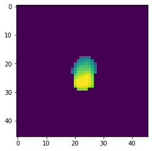
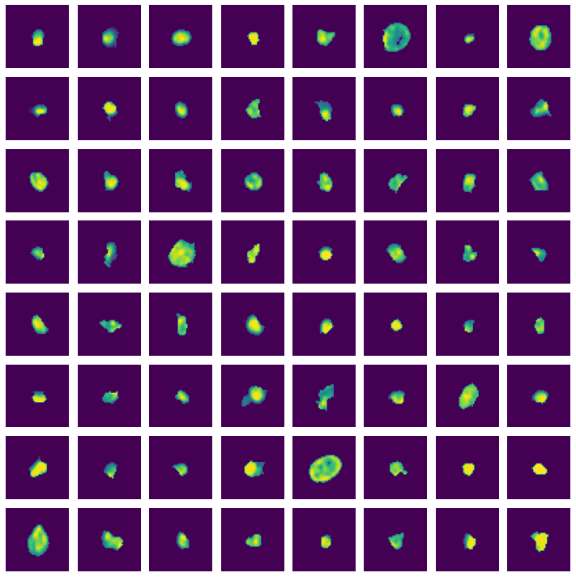

[](https://opensource.org/licenses/MIT)

# Create cell thumbnails

Module for creating thumbnail images of cells given a multi-channel TIFF
image and segmentation mask.

## Installation

``` bash
pip install cellcutter
```

## Usage

### Cut out cell thumbnails

    usage: cut_cells [-h] [-p P] [-z] [-f] [--window-size WINDOW_SIZE]
                     [--mask-cells] [--channels [CHANNELS ...]]
                     [--cache-size CACHE_SIZE]
                     [--chunk-size CHUNK_SIZE | --cells-per-chunk CELLS_PER_CHUNK]
                     image.tif segmentation_mask.tif cell_data.csv output.zarr

    Cut out thumbnail images of all cells. Thumbnails will be stored as Zarr array
    (https://zarr.readthedocs.io/en/stable/index.html) with dimensions [#channels,
    #cells, window_size, window_size]. Thumbnails overlapping the image boundary
    will be padded with zeros. The chunking shape greatly influences performance
    https://zarr.readthedocs.io/en/stable/tutorial.html#chunk-optimizations.

    positional arguments:
      image.tif             Path to image in TIFF format, potentially with
                            multiple channels. Thumbnails will be created from
                            each channel.
      segmentation_mask.tif
                            Path to segmentation mask image in TIFF format. Used
                            to automatically chose window size and find cell
                            outlines. It is optional if --window-size is given and
                            --mask-cells is not used. Pass "-" instead of a
                            segmentation mask in that case.
      cell_data.csv         Path to CSV file with a row for each cell. Must
                            contain columns CellID (must correspond to the cell
                            IDs in the segmentation mask), Y_centroid, and
                            X_centroid (the coordinates of cell centroids). Only
                            cells represented in the given CSV file will be used,
                            even if additional cells are present in the
                            segmentation mask. Cells are written to the Zarr array
                            in the same order as they appear in the CSV file.
      output.zarr           Path to a new directory where cell thumbnails will be
                            stored in Zarr format. Use -z to store thumbnails in a
                            single zip file instead.

    options:
      -h, --help            show this help message and exit
      -p P                  Number of processes run in parallel.
      -z                    Store thumbnails in a single zip file instead of a
                            directory.
      -f, --force           Overwrite existing destination directory.
      --window-size WINDOW_SIZE
                            Size of the cell thumbnail in pixels. Defaults to size
                            of largest cell.
      --mask-cells          Fill every pixel not occupied by the target cell with
                            zeros.
      --channels [CHANNELS ...]
                            Indices of channels (1-based) to include in the output
                            e.g., --channels 1 3 5. Channels are included in the
                            file in the given order. If not specified, by default
                            all channels are included. This option must be *after*
                            all positional arguments.
      --cache-size CACHE_SIZE
                            Cache size for reading image tiles in MB. For best
                            performance the cache size should be larger than the
                            size of the image. (Default: 10240 MB = 10 GB)
      --chunk-size CHUNK_SIZE
                            Desired uncompressed chunk size in MB. (See https://za
                            rr.readthedocs.io/en/stable/tutorial.html#chunk-
                            optimizations) Since the other chunk dimensions are
                            fixed as [#channels, #cells, window_size,
                            window_size], this argument determines the number of
                            cells per chunk. (Default: 32 MB)
      --cells-per-chunk CELLS_PER_CHUNK
                            Desired number of cells stored per Zarr array chunk.
                            By default this is determined automatically using the
                            chunk size parameter. Setting this option overrides
                            the chunk size parameter.

### Cut out tiles in a regular grid

    usage: cut_tiles [-h] [--step-size STEP_SIZE] [-p P] [-z] [-f]
                     [--channels [CHANNELS ...]] [--save-metadata SAVE_METADATA]
                     [--cache-size CACHE_SIZE]
                     [--chunk-size CHUNK_SIZE | --tiles-per-chunk TILES_PER_CHUNK]
                     image.tif window_size output.zarr

    Cut out tiles in a regular grid from an image. Tiles will be stored as Zarr
    array (https://zarr.readthedocs.io/en/stable/index.html) with dimensions
    [#channels, #tiles, tile_size, tile_size]. Coordinates of the created tiles
    can optionally be saved to a CSV file using the --save-metadata option. Tiles
    overlapping the image boundary will be padded with zeros. A column OutOfBounds
    will be added to the metadata file indicating if a tile is partially or
    completely outside the image bounds.

    positional arguments:
      image.tif             Path to image in TIFF format, potentially with
                            multiple channels. Thumbnails will be created from
                            each channel.
      window_size           Size of the tiles in pixels.
      output.zarr           Path to a new directory where tiles will be stored in
                            Zarr format. Use -z to store tiles in a single zip
                            file instead.

    options:
      -h, --help            show this help message and exit
      --step-size STEP_SIZE
                            Step size for the grid. Defaults to the window size to
                            create a non-overlapping grid.
      -p P                  Number of processes run in parallel.
      -z                    Store thumbnails in a single zip file instead of a
                            directory.
      -f, --force           Overwrite existing destination directory.
      --channels [CHANNELS ...]
                            Indices of channels (1-based) to include in the output
                            e.g., --channels 1 3 5. Channels are included in the
                            file in the given order. If not specified, by default
                            all channels are included. This option must be *after*
                            all positional arguments.
      --save-metadata SAVE_METADATA
                            Save a csv file with metadata for the tiles, including
                            their coordinates.
      --cache-size CACHE_SIZE
                            Cache size for reading image tiles in MB. For best
                            performance the cache size should be larger than the
                            size of the image. (Default: 10240 MB = 10 GB)
      --chunk-size CHUNK_SIZE
                            Desired uncompressed chunk size in MB. (See https://za
                            rr.readthedocs.io/en/stable/tutorial.html#chunk-
                            optimizations) Since the other chunk dimensions are
                            fixed as [#channels, #tiles, window_size,
                            window_size], this argument determines the number of
                            tiles per chunk. (Default: 32 MB)
      --tiles-per-chunk TILES_PER_CHUNK
                            Desired number of tiles stored per Zarr array chunk.
                            By default this is determined automatically using the
                            chunk size parameter. Setting this option overrides
                            the chunk size parameter.

## Example

Example data are available for [download at
mcmicro.org](https://mcmicro.org/datasets).

    cut_cells exemplar-001/registration/exemplar-001.ome.tif \
      exemplar-001/segmentation/unmicst-exemplar-001/cellMask.tif \
      exemplar-001/quantification/unmicst-exemplar-001_cellMask.csv \
      cellMaskThumbnails.zarr

## Reading the zarr array output

``` python
import zarr
from matplotlib import pyplot as plt
```

``` python
x = zarr.open("cellMaskThumbnails.zarr", mode = "r")
```

    <zarr.core.Array (12, 9522, 46, 46) uint16 read-only>

``` python
plt.imshow(x[0, 0, ...])
```



``` python
plt.figure(figsize=(10, 10))
for i in range(64):
    ax = plt.subplot(8, 8, i + 1)
    ax.axis("off")
    ax.imshow(x[0, i, ...])
plt.tight_layout()
```



## Performance

Zarr arrays are
[chunked](https://zarr.readthedocs.io/en/stable/tutorial.html?highlight=chunk#chunk-optimizations),
meaning that they are split up into small pieces of equal size, and each
chunk is stored in a separate file. Choice of the chunk size affects
performance significantly.

Performance will also vary quite a bit depending on the access pattern.
Slicing the array so that only data from a single chunk needs to be read
from disk will be fast while array slices that cross many chunks will be
slow.

An overview of some chunking performance considerations are [available
here](https://www.oreilly.com/library/view/python-and-hdf5/9781491944981/ch04.html).

By default, *cellcutter* creates Zarr arrays with chunks of the size
`[channels in TIFF, x cells, thumbnail width, thumbnail height]`,
meaning for a given cell, all channels and the entire thumbnail image
are stored in the same chunk. The number of cells `x` per chunk is
calculated internally such that each chunk has a total uncompressed size
of about 32 MB.

The default chunk size works well for access patterns that request all
channels and the entire thumbnail for a given range of cells. Ideally,
the cells should be contiguous along the second dimension of the array.

``` python
import zarr
from numpy.random import default_rng
```

``` python
z = zarr.open("cellMaskThumbnails.zarr", mode="r")
```

``` python
z.shape
```

    (12, 9522, 46, 46)

``` python
z.chunks
```

    (12, 660, 46, 46)

The `chunks` property gives the size of each chunk in the array. In this
example, all 12 channels, 660 cells, and the complete thumbnail are
stored in a single chunk.

The number of cells per chunk is determined automatically by default and
can be set directly using the `--cells-per-chunk` argument to
*cellcutter* or alternatively indirectly using `--chunk-size`.

Also here the number of cells per chunk should ideally be more or less
in line with how many cells are requested in a typical array access
operation.

### Access patterns

#### 100 Random cells

``` python

rng = default_rng()
def rand_slice(n=100):
    return rng.choice(z.shape[1], size=n, replace=False)
```

``` python
%%timeit
_ = z.get_orthogonal_selection((slice(None), rand_slice()))
```

    101 ms ± 2.01 ms per loop (mean ± std. dev. of 7 runs, 10 loops each)

#### 100 Contiguous cells

``` python
%%timeit
_ = z[:, 1000:1100, ...]
```

    5.81 ms ± 45.3 µs per loop (mean ± std. dev. of 7 runs, 100 loops each)

Accessing **100 random cells** from the Zarr array takes around 100 ms
whereas accessing **100 contiguous cells** (cell 1000 to 1100) only
takes around 6 ms — an almost 17-fold speed difference. This is because
random cells are likely to be distributed across many separate chunks.
All these chunks need to be read into memory in full even if only a
single cell is requested for a given chunk. Given that this particular
array happens to be split up into 15 chunks total the speed difference
suggests that every request of 100 random cells results in all chunks
being read from disk

In contrast, contiguous cells are stored together in one or several
neighboring chunks minimizing the amount of data that has to be read
from disk.

### Fast access to random cells

If access to random cells is required, for example for training a
machine learning model, there is a workaround avoiding the performance
penalty of requesting random cells. Instead of requesting a random
slices of the array we can instead randomize cell order before the Zarr
array is created. Because cell order is random we can then simply access
a contiguous slice of cells during training. The simplest way to
randomize cell order is to shuffle the order of rows in the CSV file
that is passed to *cellcutter*, for example by using *pandas*
`df.sample(frac=1)`.

A training loop using cell thumbnails created with this method could
look something like this:

``` python
import pandas as pd
from timeit import default_timer
```

``` python
csv = pd.read_csv("exemplar-001/quantification/unmicst-exemplar-001_cellMask.csv")
P = 0.2

# batch sizes
batch_size_train = 500
batch_size_valid = round(batch_size_train * P)

# training loop
for i, s in enumerate(
    range(0, len(csv) - batch_size_train - batch_size_valid, batch_size_train + batch_size_valid)
):
    # construct training and validation slices
    train_slice = (s, s + batch_size_train)
    valid_slice = (train_slice[1], train_slice[1] + batch_size_valid)
    # get training and validation thumbnails
    start_time = default_timer()
    x_train = z[:, train_slice[0]:train_slice[1], ...]
    x_valid = z[:, valid_slice[0]:valid_slice[1], ...]
    end_time = default_timer()
    print(
        f"Iteration {i} training using cells {train_slice}",
        f"validating using cells {valid_slice}",
        f"loading images took {round(end_time - start_time, 3)}s"
    )
    # Do training
```

    Iteration 0 training using cells (0, 500) validating using cells (500, 600) loading images took 0.018s
    Iteration 1 training using cells (600, 1100) validating using cells (1100, 1200) loading images took 0.03s
    Iteration 2 training using cells (1200, 1700) validating using cells (1700, 1800) loading images took 0.024s
    Iteration 3 training using cells (1800, 2300) validating using cells (2300, 2400) loading images took 0.023s
    Iteration 4 training using cells (2400, 2900) validating using cells (2900, 3000) loading images took 0.023s
    Iteration 5 training using cells (3000, 3500) validating using cells (3500, 3600) loading images took 0.023s
    Iteration 6 training using cells (3600, 4100) validating using cells (4100, 4200) loading images took 0.023s
    Iteration 7 training using cells (4200, 4700) validating using cells (4700, 4800) loading images took 0.023s
    Iteration 8 training using cells (4800, 5300) validating using cells (5300, 5400) loading images took 0.023s
    Iteration 9 training using cells (5400, 5900) validating using cells (5900, 6000) loading images took 0.027s
    Iteration 10 training using cells (6000, 6500) validating using cells (6500, 6600) loading images took 0.02s
    Iteration 11 training using cells (6600, 7100) validating using cells (7100, 7200) loading images took 0.019s
    Iteration 12 training using cells (7200, 7700) validating using cells (7700, 7800) loading images took 0.023s
    Iteration 13 training using cells (7800, 8300) validating using cells (8300, 8400) loading images took 0.023s
    Iteration 14 training using cells (8400, 8900) validating using cells (8900, 9000) loading images took 0.025s

## Funding

This work is supported by the following:

- NCI grants U54-CA22508U2C-CA233262 and U2C-CA233280
- NIH grant 1U54CA225088: Systems Pharmacology of Therapeutic and
  Adverse Responses to Immune Checkpoint and Small Molecule Drugs
